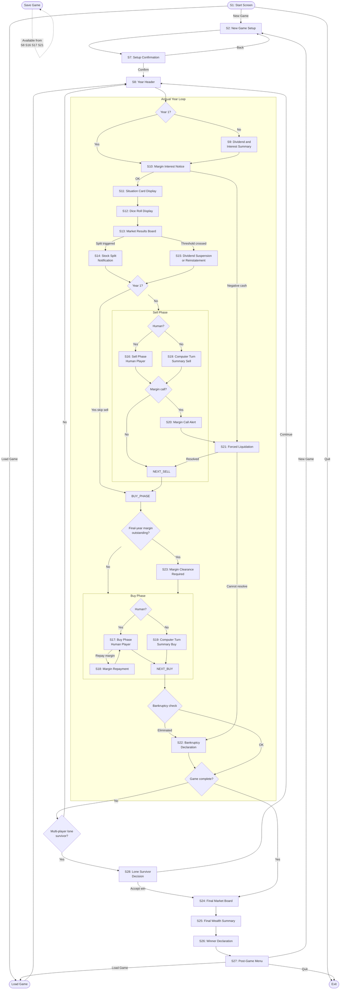

# Stocks and Bonds — UI Screen Flow

Status: Current  
Authority: UI screens and navigation  
Depends on: `specification.md`, `save-load-design.md`  
Supersedes: Conflicting UI assumptions in `archive/project-timeline.md`

---

## 1. Overview

This document defines all user interface screens required for the Stocks and Bonds
game, the data each screen receives and returns, and the navigation paths between
screens. It is the authoritative reference for authors writing screen and display
procedures.

Screen identifiers (S1–S27) are stable references used in procedure naming
conventions and cross-document citations. Gaps in the numbering sequence are
intentional; numbers are assigned by first appearance in navigation order and
are not renumbered.

---

## 2. Screen Index

| ID  | Name                              | Triggered By                                      |
|-----|-----------------------------------|---------------------------------------------------|
| S1  | Start Screen                      | Application launch; post-game menu                |
| S2  | New Game Setup                    | S1 NEW_GAME                                       |
| S7  | Setup Confirmation                | S2 completion                                     |
| S8  | Year Header                       | S7 CONFIRM; load game completion; year advance    |
| S9  | Dividend and Interest Summary     | Year loop Step 1 (skipped Year 1 only)            |
| S10 | Margin Interest Notice            | Year loop Step 2                                  |
| S11 | Situation Card Display            | Year loop Step 3                                  |
| S12 | Dice Roll Display                 | Year loop Step 5                                  |
| S13 | Market Results Board              | Year loop Steps 6–8                               |
| S14 | Stock Split Notification          | S13 when split triggered                          |
| S15 | Dividend Suspension/Reinstatement | S13 when threshold crossed                        |
| S16 | Sell Phase — Human Player         | Year loop Step 9, human player turn               |
| S17 | Buy Phase — Human Player          | Year loop Step 10, human player turn              |
| S18 | Margin Repayment                  | S17 when player selects repay margin              |
| S19 | Computer Player Turn Summary      | Year loop Steps 9–10, computer player turn        |
| S20 | Margin Call Alert                 | Step 9/10 when currentPrice <= MarginCallPrice    |
| S21 | Forced Liquidation                | S10 negative cash; S20 margin call                |
| S22 | Bankruptcy Declaration            | S21 unresolvable obligation                       |
| S23 | Margin Clearance Required         | Final year when marginTotal > 0                   |
| S24 | Final Market Board                | Closing-price draw completion after final year   |
| S25 | Final Wealth Summary              | S24                                               |
| S26 | Winner Declaration                | S25                                               |
| S27 | Post-Game Menu                    | S26                                               |
| S28 | Lone Survivor Decision            | Multiplayer game reaches one non-bankrupt player  |
| --  | Load Game                         | S1 LOAD_GAME; S27 LOAD_GAME                       |
| --  | Save Game                         | Player-initiated from any major screen            |

---

## 3. Data Flow Reference

Data types used below:

- `INTEGER` — whole number
- `BOOLEAN` — TRUE or FALSE
- `STRING` — text value with implied max length per context
- `ENUM{...}` — one value from the listed set
- `ARRAY[]` — indexed collection

---

### S1 — Start Screen

```
IN:  (none)

OUT: action : ENUM{NEW_GAME, LOAD_GAME, QUIT}
```

---

### S2 — New Game Setup

```
IN:  (none)

OUT: playerCount    : INTEGER            (1–6)
     playerName[i]  : STRING             (per player)
     playerType[i]  : ENUM{HUMAN, COMP}  (per player)
     marketRollMode : ENUM{A, B, C}
```

---

### S7 — Setup Confirmation

```
IN:  playerCount    : INTEGER
     playerName[i]  : STRING
     playerType[i]  : ENUM{HUMAN, COMP}
     marketRollMode : ENUM{A, B, C}

OUT: action : ENUM{CONFIRM, BACK}
```

If BACK: return to S2 with all values pre-populated for correction.

---

### S8 — Year Header

```
IN:  currentYear       : INTEGER
     totalYears        : INTEGER
     marketRollMode    : ENUM{A, B, C}
     noDividendYear    : BOOLEAN   (TRUE when currentYear = 1 or 10)
     noMarginBuyYear   : BOOLEAN   (TRUE when currentYear = 10)
     noSellPhaseYear   : BOOLEAN   (TRUE when currentYear = 1)

OUT: action : ENUM{CONTINUE}
```

---

### S9 — Dividend and Interest Summary

Skipped when `currentYear = 1`.

```
IN:  currentYear              : INTEGER
     playerName               : STRING
     cashBefore               : INTEGER
     dividendsReceived[stock] : INTEGER   (per stock; 0 if none or suspended)
     bondInterest[bond]       : INTEGER   (per bond type held)
     totalReceived            : INTEGER
     cashAfter                : INTEGER

OUT: action : ENUM{CONTINUE}
```

Displayed once per player. Engine iterates players; screen renders one at a time.

---

### S10 — Margin Interest Notice

```
IN:  playerName              : STRING
     marginTotal             : INTEGER
     marginCharge            : INTEGER
     cashBefore              : INTEGER
     cashAfter               : INTEGER
     forcedLiquidationNeeded : BOOLEAN

OUT: action : ENUM{CONTINUE, LIQUIDATE}
```

If `forcedLiquidationNeeded = TRUE`: engine routes to S21 after acknowledgement.

---

### S11 — Situation Card Display

```
IN:  cardNumber          : INTEGER
     cardType            : ENUM{BULL, BEAR}
     flavourText         : STRING
     effects[]           : ARRAY of {stockId: INTEGER, priceDelta: INTEGER}
     dividendBonus       : INTEGER   (0 if card has no bonus; nonzero for Card 1)

OUT: action : ENUM{CONTINUE}
```

---

### S12 — Dice Roll Display

```
IN:  marketRollMode : ENUM{A, B, C}
     rolls[]        : ARRAY of {stockId: INTEGER, dieOne: INTEGER,
                                dieTwo: INTEGER, total: INTEGER}
```

Under modes A and B (single roll): `rolls[]` has one entry; `stockId` unused.
Under mode C (per-stock roll): `rolls[]` has one entry per stock.

```
OUT: action : ENUM{CONTINUE}
```

---

### S13 — Market Results Board

```
IN:  stocks[] : ARRAY of {
         stockName          : STRING
         priceBeforeCard    : INTEGER
         marketTableDelta   : INTEGER
         cardDelta          : INTEGER
         newPrice           : INTEGER
         splitTriggered     : BOOLEAN
         dividendSuspended  : BOOLEAN
         dividendReinstated : BOOLEAN
         atBankruptcy       : BOOLEAN
     }

OUT: action : ENUM{CONTINUE}
```

Engine routes to S14 for each stock where `splitTriggered = TRUE`.
Engine routes to S15 for each stock where `dividendSuspended` or
`dividendReinstated` changed state this year.

---

### S14 — Stock Split Notification

One display per split event.

```
IN:  stockName  : STRING
     oldPrice   : INTEGER
     newPrice   : INTEGER
     players[]  : ARRAY of {playerName: STRING,
                             sharesBefore: INTEGER,
                             sharesAfter: INTEGER}

OUT: action : ENUM{CONTINUE}
```

---

### S15 — Dividend Suspension / Reinstatement

One display per threshold-crossing event.

```
IN:  stockName   : STRING
     event       : ENUM{SUSPENDED, REINSTATED}
     newPrice    : INTEGER
     cutoffPrice : INTEGER

OUT: action : ENUM{CONTINUE}
```

---

### S16 — Sell Phase — Human Player

Skipped when `currentYear = 1`.

```
IN:  currentYear    : INTEGER
     playerName     : STRING
     cashBalance    : INTEGER
     marginTotal    : INTEGER
     portfolio[]    : ARRAY of {
         stockId     : INTEGER
         stockName   : STRING
         sharesOwned : INTEGER
         currentPrice: INTEGER
         marginHeld  : BOOLEAN
     }
     bondHoldings[] : ARRAY of {
         bondId      : INTEGER
         denomination: INTEGER
         units       : INTEGER
         parValue    : INTEGER
     }

OUT: sellOrders[] : ARRAY of {
         assetType : ENUM{STOCK, BOND}
         assetId   : INTEGER
         quantity  : INTEGER
     }
     action : ENUM{CONFIRM, PASS}
```

---

### S17 — Buy Phase — Human Player

```
IN:  currentYear         : INTEGER
     playerName          : STRING
     cashBalance         : INTEGER
     marginTotal         : INTEGER
     marginEligible      : BOOLEAN   (had prior cash purchase)
     marginAllowedYear   : BOOLEAN   (FALSE in final year)
     stockPrices[]       : ARRAY of {stockId: INTEGER,
                                     stockName: STRING,
                                     currentPrice: INTEGER}
     bondOptions[]       : ARRAY of {bondId: INTEGER,
                                     denomination: INTEGER,
                                     parValue: INTEGER,
                                     interestPerUnit: INTEGER}

OUT: buyOrders[] : ARRAY of {
         assetType    : ENUM{STOCK, BOND}
         assetId      : INTEGER
         quantity     : INTEGER
         purchaseType : ENUM{CASH, MARGIN}
     }
     marginRepayment : INTEGER   (0 if none)
     action          : ENUM{CONFIRM, PASS}
```

---

### S18 — Margin Repayment

Invoked from within S17 when player selects repay margin option.

```
IN:  marginTotal  : INTEGER
     cashBalance  : INTEGER
     maxRepayable : INTEGER   (MIN of marginTotal and cashBalance)

OUT: amountToRepay : INTEGER
```

Returns to S17 after input. Engine applies repayment; S17 re-displays updated
cash and margin balances.

---

### S19 — Computer Player Turn Summary

Used for both sell and buy phases.

```
IN:  playerName  : STRING
     phase       : ENUM{SELL, BUY}
     decisions[] : ARRAY of {
         action    : ENUM{SELL, BUY, REPAY, PASS}
         assetType : ENUM{STOCK, BOND}
         assetId   : INTEGER
         quantity  : INTEGER
     }

OUT: action : ENUM{CONTINUE}
```

---

### S20 — Margin Call Alert

```
IN:  playerName      : STRING
     stockName       : STRING
     currentPrice    : INTEGER
     marginCallPrice : INTEGER
     amountDue       : INTEGER

OUT: action : ENUM{ENTER_LIQUIDATION}
```

Routes unconditionally to S21. No player choice at this screen.

---

### S21 — Forced Liquidation

Re-entered in a loop until obligation is met or bankruptcy is declared.

```
IN:  playerName          : STRING
     obligationRemaining : INTEGER
     cashBalance         : INTEGER
     portfolio[]         : ARRAY of {stockId, stockName, sharesOwned,
                                     currentPrice, marginHeld}
     bondHoldings[]      : ARRAY of {bondId, denomination, units, parValue}

OUT: liquidationOrders[] : ARRAY of {
         assetType : ENUM{STOCK, BOND}
         assetId   : INTEGER
         quantity  : INTEGER
     }
     action : ENUM{SUBMIT, DECLARE_BANKRUPTCY}
```

Engine applies orders, recalculates `obligationRemaining` and `cashBalance`,
then re-enters S21 if obligation remains and holdings exist.
Routes to S22 if `DECLARE_BANKRUPTCY` or if no holdings remain and
`cashBalance < 0`.

---

### S22 — Bankruptcy Declaration

```
IN:  playerName : STRING
     finalCash  : INTEGER
     reason     : ENUM{MARGIN_INTEREST, MARGIN_CALL}
     yearNumber : INTEGER

OUT: action : ENUM{CONTINUE}
```

Engine sets `isBankrupt = TRUE`, removes player from turn order.
Control returns to the year loop at the next active player.

---

### S23 — Margin Clearance Required

Entered once per player during the final year if `marginTotal > 0` and margin
must be cleared before end-of-game wealth is computed.

```
IN:  playerName  : STRING
     marginTotal : INTEGER
     cashBalance : INTEGER
     portfolio[] : ARRAY of {stockId, stockName, sharesOwned, currentPrice}
     bondHoldings[] : ARRAY of {bondId, denomination, units, parValue}

OUT: repayActions[] : ARRAY of {
         assetType : ENUM{STOCK, BOND}
         assetId   : INTEGER
         quantity  : INTEGER
     }
```

Loop re-enters S23 until `marginTotal = 0`. No new margin purchases are allowed
in the final year. Bankruptcy rules still apply here.

---

### S24 — Final Market Board

```
IN:  stocks[] : ARRAY of {stockName: STRING, finalPrice: INTEGER}

OUT: action : ENUM{CONTINUE}
```

No dividends or interest are displayed. Prices reflect the separate closing
market draw resolved after the final year's buy phase.

---

### S25 — Final Wealth Summary

```
IN:  players[] : ARRAY of {
         playerName  : STRING
         cashBalance : INTEGER
         stockValue  : INTEGER
         bondValue   : INTEGER
         totalWealth : INTEGER
     }
```

Array is pre-sorted by `totalWealth` descending before passing to this screen.

```
OUT: action : ENUM{CONTINUE}
```

---

### S26 — Winner Declaration

```
IN:  winners[] : ARRAY of {playerName: STRING, totalWealth: INTEGER}
```

Array contains one entry for a sole winner; multiple entries for tied players.
Tie condition: two or more players share the highest `totalWealth`.

```
OUT: action : ENUM{CONTINUE}
```

---

### S27 — Post-Game Menu

```
IN:  (none)

OUT: action : ENUM{NEW_GAME, LOAD_GAME, QUIT}
```

---

### S28 — Lone Survivor Decision

Used only in multiplayer games. Single-player games never route here.

```
IN:  playerName     : STRING
     currentYear    : INTEGER
     totalYears     : INTEGER

OUT: action : ENUM{ACCEPT_WIN, CONTINUE_PLAY}
```

---

### Save Game (Global)

Available as a player-initiated action from S8, S16, S17, and S21.

```
IN:  complete game state snapshot (see save/load data structure document
     when produced)

OUT: action : ENUM{SAVED, CANCELLED}
```

Control returns to the screen that invoked save after completion.

---

## 4. Navigation Diagram



---

## 5. State Lifecycle Notes

### Save Game Availability

Save is permitted at the start of any year (S8), during the sell phase (S16),
during the buy phase (S17), and during forced liquidation (S21). Save is not
permitted mid-market-resolution (S11–S15) because game state is partially
updated and not consistent for reload.

### Bankruptcy and Turn Order

When S22 is reached, the player is flagged `isBankrupt = TRUE` and removed from
the active player list. The year loop skips bankrupt players in all subsequent
sell and buy phases. If this leaves one non-bankrupt player in a multiplayer
game, route to S28 for the project-defined lone-survivor decision.

### Year 1 Exceptions

- S9 (dividends and interest) is skipped.
- S10 (margin interest) is skipped.
- The sell phase (S16/S19) is skipped entirely.
- `SELL_GATE` routes directly to the buy phase.

### Final-Year Exceptions

- S9 (dividends and interest) still runs.
- S10 (margin interest) still runs.
- Margin purchases are prohibited in S17 and S19.
- S23 (margin clearance) is enforced before final wealth is computed for any
  player with `marginTotal > 0`.
- After Step 11, engine performs one closing market draw, then routes to S24
  with those closing prices before computing final wealth.

### Lone Survivor Rule

- In a multiplayer game, if only one non-bankrupt player remains, route to S28.
- If the player chooses `ACCEPT_WIN`, route directly to S24.
- If the player chooses `CONTINUE_PLAY`, continue normal year progression.
- Single-player games do not route to S28.

### Computer Players

Computer players never see interactive screens. S19 provides a display of
the AI decision for transparency. The engine applies AI decisions directly;
S19 is display-only with a single CONTINUE acknowledgement from a human
observer (or auto-advances after a configurable delay).
